# ⚡ AMM Odečet elektroměru – ESP32

<sub>English summary available below / Zkrácená anglická verze je níže</sub>

Firmware pro ESP32 umožňující odečet dat z AMM elektroměru (ČEZ) přes rozhraní HAN, s webovým rozhraním a volitelnou integrací do Home Assistant.

> ⚠️ Funkce pro EG.D a PRE není zatím k dispozici, jelikož nejsem na jejich distribučním území. Pokud mi dodáte RAW HEX, který elektroměr posílá, můžu se pokusit o jejich zprovoznění.

> **Verze firmware:** 0.1 ČEZ

---

## 📋 Obsah

- [Proč používat odečet přes HAN?](#-proč-používat-odečet-přes-han)
- [Funkce](#-funkce)
- [Podporované elektroměry](#-podporované-elektroměry)
- [Používání v souladu s připojovacími podmínkami](#-používání-v-souladu-s-připojovacími-podmínkami)
- [Hardware](#-hardware)
- [Zapojení](#-zapojení)
- [Instalace](#-instalace)
- [Připojení](#-připojení)
- [Webové rozhraní](#-webové-rozhraní)
- [Mobilní layout](#-mobilní-layout)
- [Integrace s Home Assistant](#-integrace-s-home-assistant)
- [SD karta a logování](#-sd-karta-a-logování)
- [Události (eventy)](#-události-eventy)
- [OBIS kódy](#-obis-kódy)
- [Resetování zařízení](#-resetování-zařízení)
- [Jak tento projekt vznikl](#-jak-tento-projekt-vznikl)
- [Licence](#-licence)
- [Summary (English)](#-summary-english)

---

## 💡 Proč používat odečet přes HAN?

Elektroměr sice podporuje dálkový odečet přes síť mobilního operátora (pokud je zařazen do kategorie měření C1), ale tato data nejsou dostupná v reálném čase – distributor je poskytuje pouze periodicky a se zpožděním. Nelze je tedy využít k přímému řízení spotřebičů nebo systémů chytré domácnosti.

Rozhraní HAN situaci mění: elektroměr přes něj odesílá naměřená data **každou minutu**, což umožňuje poměrně přesné sledování okamžité spotřeby a dodávky. Na základě těchto dat lze automaticky spínat spotřebiče, řídit nabíjení baterií, ohřev vody nebo jiné systémy – a to vše v téměř reálném čase, bez závislosti na portálu distributora.

## ✅ Funkce

- Čtení dat z AMM elektroměru přes RS485
- Sledování 22 OBIS registrů (energie, výkon, tarifly, stav odpojovače…)
- Webové rozhraní přístupné přes Wi-Fi (STA i AP mód)
- Logování dat na SD kartu ve formátu CSV (denní soubory)
- Logování událostí (eventy) do `.log` souborů
- Interaktivní grafy: P+ odběr, P- dodávka, A+ energie, A- energie
- Synchronizace času přes NTP, záložní RTC modul
- Integrace s Home Assistant přes MQTT
- OTA aktualizace firmware přes webové rozhraní
- Automatické přepínání Wi-Fi ↔ AP mód při výpadku sítě
- Automatické přepínání letního a zimního času (CET/CEST)

---

## ⚡ Podporované elektroměry

Firmware funguje se všemi používanými AMM elektroměry v síti ČEZ Distribuce – na výrobci elektroměru nezáleží. Podporovány jsou jak **jednofázové**, tak **třífázové** elektroměry. Zobrazování údajů na hlavní stránce lze přizpůsobit v záložce **Nastavení** – například pokud máte jednofázový elektroměr, můžete skrýt údaje pro fáze L2 a L3 a zobrazovat pouze L1.

---

## ⚖️ Používání v souladu s připojovacími podmínkami

Při instalaci je nutné dodržet připojovací podmínky ČEZ Distribuce. Dle **kapitoly 3.4 – Vybavení elektroměrového rozváděče** aktuálně není povoleno umístit zařízení pro vyčítání dat přímo v elektroměrovém rozváděči, jelikož zde není uvedeno. Do rozváděče smí vstupovat pouze kabel RJ12, který vede ven.

Distributor zároveň specifikuje místo připojení rozhraní HAN:

> *Rozhraní HAN se připojuje do konektoru RJ12 Female, který je umístěný a přístupný na relé boxu (není-li relé box instalován, pak je přístupný na elektroměru).*

Na rozdíl od optického rozhraní (které je u AMM elektroměrů zakázáno) není připojené zařízení na rozhraní HAN nutné schvalovat. Rozhraní HAN je pouze pro čtení dat (read only) – není tedy možné přes něj jakkoliv ovlivnit funkci elektroměru, a z tohoto důvodu nepodléhá testování ani schvalovacímu procesu.

> *Zařízení / převodník si pořizuje na své náklady uživatel DS, jeho napojení provádí uživatel DS.*

> ⚠️ **Uživatel je povinen udržovat odběrné místo v souladu s technickými normami a připojovacími podmínkami distributora.**
>
> Pokud je k instalaci kabelu RJ12 nutné rozplombovat odběrné místo, platí tato pravidla:
>
> - 🔴 **Rozplombování je VŽDY nutné předem ohlásit distributorovi**
> - 🔴 **Veškeré úpravy v elektroměrovém rozváděči smí provádět výhradně elektrikář s platným osvědčením dle NV 194/2022**
>
> Nedodržení těchto povinností může mít právní důsledky. Za dodržení všech předpisů zodpovídá uživatel.

---

## 🔧 Hardware

| Komponenta | Poznámka |
|---|---|
| ESP32 | Testováno na ESP32 DevKit |
| RS485 modul | Připojen na UART2 (piny 16/17) |
| SD karta (SPI) | CS: 4, MOSI: 27, SCK: 25, MISO: 26 |
| RTC modul | I2C (SDA: 21, SCL: 22), volitelný |
| Tlačítko reset | Pin 33 |

### SD karta

SD karta **není povinná**, ale bez ní nebude fungovat:

- Logování dat do CSV souborů
- Zobrazování grafů odběru a dodávky
- Stahování logů přes webové rozhraní
- Logování událostí (eventy)
- Správa limitu velikosti logů

Bez SD karty zůstává plně funkční webový dashboard s živými hodnotami a integrace s Home Assistant přes MQTT.

### RTC modul

RTC modul **není povinný**, ale je **doporučený pro přesné logování**. Elektroměr neposílá OBIS kód s časem, takže nelze brát jako autoritu času. Zařízení sice synchronizuje čas přes NTP, ale při výpadku internetu nebo před první synchronizací může být čas nepřesný. RTC modul zajišťuje, že záznamy v CSV souborech budou mít vždy správné časové razítko i bez připojení k internetu.

---

## 🔌 Zapojení

```
Elektroměr (RJ12)  →  RS485 modul  →  ESP32
         A/B                         GPIO16 (RX) / GPIO17 (TX)
```

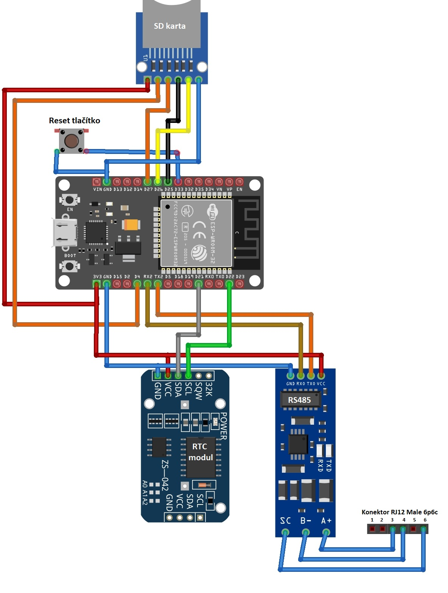

---

## 🚀 Instalace

### Požadavky

- Arduino IDE nebo PlatformIO
- ESP32 board support (espressif/arduino-esp32)

### Závislosti – knihovny

| Knihovna | Autor | Zdroj |
|---|---|---|
| `AsyncTCP` | Me-No-Dev | [GitHub](https://github.com/me-no-dev/AsyncTCP) |
| `ESPAsyncWebServer` | Me-No-Dev | [GitHub](https://github.com/me-no-dev/ESPAsyncWebServer) |
| `PubSubClient` | Nick O'Leary | [GitHub](https://github.com/knolleary/pubsubclient) |
| `SD` (SPI) | Arduino / Espressif | součást ESP32 Arduino core |
| `SPI` | Arduino / Espressif | součást ESP32 Arduino core |
| `Wire` (I2C) | Arduino / Espressif | součást ESP32 Arduino core |
| `Preferences` | Espressif | součást ESP32 Arduino core |
| `DNSServer` | Espressif | součást ESP32 Arduino core |
| `Update` (OTA) | Espressif | součást ESP32 Arduino core |
| `WiFi` | Espressif | součást ESP32 Arduino core |
| `time.h` | součást libc/ESP-IDF | součást ESP32 Arduino core |

> Knihovny označené jako „součást ESP32 Arduino core" není třeba instalovat zvlášť – jsou dostupné automaticky po přidání ESP32 desky do Arduino IDE.

### Postup

1. Klonuj repozitář:
   ```bash
   git clone https://github.com/kacer11/odecet-amm-han.git
   ```
2. Otevři `.ino` soubor v Arduino IDE
3. Vyber správnou desku: **ESP32 Dev Module**
4. Nahraj firmware na zařízení

> **Alternativa bez Arduino IDE:** V repozitáři je přiložen předkompilovaný `.bin` soubor, který lze nahrát přímo do ESP32 Dev Board například pomocí nástroje [ESP Flash Download Tool](https://www.espressif.com/en/support/download/other-tools) nebo příkazem:
> ```bash
> esptool.py --port COM3 write_flash 0x0 ver01_CEZ.bin
> ```
> *(port COM3 nahraď správným portem svého zařízení)*

---

## 📶 Připojení

Po prvním nahrání ESP32 vytvoří Wi-Fi přístupový bod `AMM_Setup` s výchozím heslem `12345678`. Připoj se na něj a nastav Wi-Fi síť přes webové rozhraní.

Pokud dojde ke ztrátě Wi-Fi, ESP se pokusí 3x připojit (1x za 30s), pokud se mu to nepodaří, přejde opět do AP režimu. Na pozadí se ale stále bude snažit připojit k původní Wi-Fi. Pokud se to podaří, přejde opět do STA módu a uživatel nic nepozná.

---

## 🌐 Webové rozhraní

Po připojení k síti je dostupné na IP adrese zařízení (zobrazí se v Serial Monitoru, nebo vyhledat přes scan sítě).

| Sekce | Popis |
|---|---|
| Dashboard | Živé hodnoty ze všech OBIS registrů |
| Grafy | Vizualizace odběru a dodávky v čase |
| Logy | Stažení CSV souborů dle data |
| Události | Přehled a stahování event logů |
| Nastavení | Wi-Fi, SD karta, Home Assistant |
| OTA update | Nahrání nového firmware přes prohlížeč |

---

## 📱 Mobilní layout

Webové rozhraní je plně optimalizováno pro mobilní telefony a tablety. Ať už kontroluješ aktuální odběr na cestách nebo jsi jen doma zvědaví, vše funguje pohodlně i na malé obrazovce – bez nutnosti instalace jakékoliv aplikace. Stačí otevřít prohlížeč a zadat IP adresu zařízení.

---

## 🏠 Integrace s Home Assistant

Firmware podporuje odesílání dat do Home Assistant přes **MQTT broker**. ESP32 implementuje funkci **MQTT Discovery** – po zapnutí a správném nastavení MQTT si Home Assistant všechny entity (senzory, stavy) najde a nakonfiguruje automaticky, bez jakéhokoliv ručního zásahu.

### Nastavení

1. V nastavení webového rozhraní zapni **Home Assistant**
2. Zadej IP adresu a port MQTT brokera (výchozí: `1883`)
3. Nastav Client ID (výchozí: `AMM_ESP32`)
4. Volitelně zadej **uživatelské jméno a heslo** pro autentizaci k MQTT brokeru

> Pokud jsou pole pro uživatelské jméno a heslo prázdná, firmware se připojí k brokeru anonymně.
---

## 💾 SD karta a logování

Velikost SD karty **není určena automaticky** – je nutné ji ručně zadat v záložce **Nastavení** webového rozhraní. Pokud tak neučiníte, platí výchozí limit **100 MB** pro celkovou velikost logů.

Po dosažení nastaveného limitu firmware automaticky přemazává nejstarší soubory, aby se předešlo zaplnění karty. Doporučuji velikost nastavit co nejdříve po prvním spuštění, aby byl limit co nejpřesnější.

---

## 🔔 Události (eventy)

Firmware rozlišuje dva typy událostí, které se logují do souborů na SD kartě:

### Výměna elektroměru

ESP32 si trvale ukládá sériové číslo elektroměru do paměti (NVS). Díky tomu dokáže zaregistrovat výměnu elektroměru i po výpadku napájení – jakmile se po startu načte jiné SN, událost se zapíše do logu a **upozornění se zobrazí na hlavní stránce webového rozhraní**.

Do Home Assistant se tato událost samostatně neposílá – přes MQTT totiž putuje přímo sériové číslo elektroměru jako OBIS hodnota. V HA lze jednoduše nastavit upozornění při změně tohoto SN.

### Vybitá baterie RTC

Pokud ESP32 zjistí, že baterie RTC modulu je vybitá nebo modul nefunguje správně, událost se zobrazí na **hlavní stránce webového rozhraní** a zároveň se odešle do **Home Assistant**.

Událost lze potvrdit (uzavřít) dvěma způsoby – obě strany jsou synchronizovány:

- **Z webového rozhraní** – zavření eventu se automaticky promítne i do HA (informace do HA přijde společně s OBIS kódy, takže prodleva může být i minutu)
- **Z Home Assistant** – stisknutím tlačítka potvrzující výměnu baterie (součást entity zařízení v HA) se event ukončí i ve webovém rozhraní

---

## 📊 OBIS kódy

Firmware čte celkem **22 OBIS registrů**:

### Informace o elektroměru

| OBIS kód | Popis | Typ | Jednotka |
|---|---|---|---|
| `0-0:96.1.1.255` | Sériové číslo elektroměru | string | – |
| `0-0:96.14.0.255` | Aktuální tarif | string | – |

### Odpojovače a limiter

| OBIS kód | Popis | Typ | Jednotka |
|---|---|---|---|
| `0-0:96.3.10.255` | Stav hlavního odpojovače | bool | – |
| `0-0:17.0.0.255` | Limiter | number | – |
| `0-1:96.3.10.255` | Relé R1 | bool | – |
| `0-2:96.3.10.255` | Relé R2 | bool | – |
| `0-3:96.3.10.255` | Relé R3 | bool | – |
| `0-4:96.3.10.255` | Relé R4 | bool | – |

### Okamžitý výkon P+ (odběr)

| OBIS kód | Popis | Typ | Jednotka |
|---|---|---|---|
| `1-0:1.7.0.255` | P+ celkem | number | W |
| `1-0:21.7.0.255` | P+ fáze L1 | number | W |
| `1-0:41.7.0.255` | P+ fáze L2 | number | W |
| `1-0:61.7.0.255` | P+ fáze L3 | number | W |

### Okamžitý výkon P- (dodávka)

| OBIS kód | Popis | Typ | Jednotka |
|---|---|---|---|
| `1-0:2.7.0.255` | P- celkem | number | W |
| `1-0:22.7.0.255` | P- fáze L1 | number | W |
| `1-0:42.7.0.255` | P- fáze L2 | number | W |
| `1-0:62.7.0.255` | P- fáze L3 | number | W |

### Energie A+ (odběr celkem a tarify)

| OBIS kód | Popis | Typ | Jednotka |
|---|---|---|---|
| `1-0:1.8.0.255` | A+ celkem | number | kWh |
| `1-0:1.8.1.255` | A+ tarif T1 | number | kWh |
| `1-0:1.8.2.255` | A+ tarif T2 | number | kWh |
| `1-0:1.8.3.255` | A+ tarif T3 | number | kWh |
| `1-0:1.8.4.255` | A+ tarif T4 | number | kWh |

### Energie A- (dodávka)

| OBIS kód | Popis | Typ | Jednotka |
|---|---|---|---|
| `1-0:2.8.0.255` | A- celkem | number | kWh |

---

## 🔄 Resetování zařízení

Reset lze provést dvěma způsoby:

### Webové rozhraní

V záložce **Nastavení** jsou k dispozici tlačítka pro reset Wi-Fi i tovární reset – jde o nejpohodlnější způsob, pokud je zařízení dostupné v síti.

### Záchranné tlačítko (GPIO33)

V případě, že zařízení není dostupné přes síť, lze reset provést fyzickým tlačítkem na pinu **GPIO33**:

| Doba držení | Akce |
|---|---|
| 3–6 sekund | Reset Wi-Fi přihlašovacích údajů |
| 10–15 sekund | Tovární reset (smaže i logy na SD kartě) |

---

## 🖼️ Screenshoty

### Hlavní stránka (desktop)
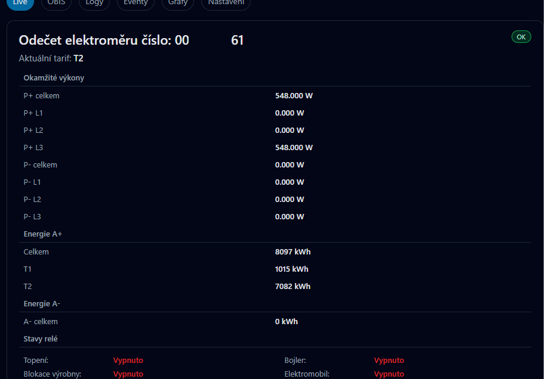

### Hlavní stránka (mobilní zobrazení)
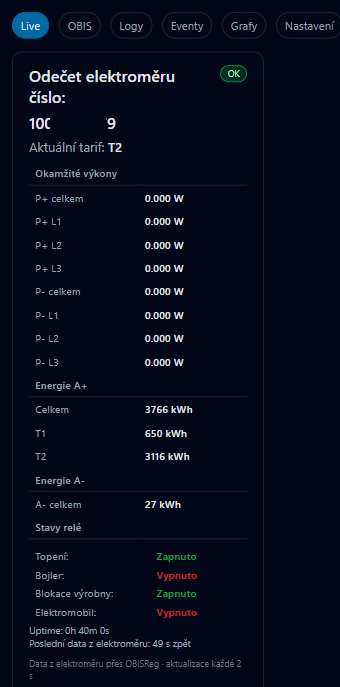

### OBIS registry
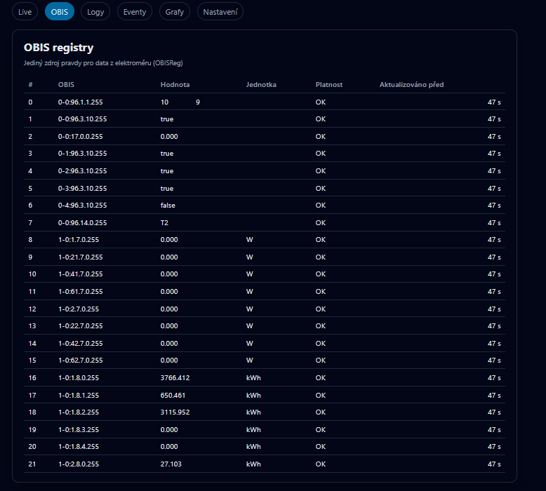

### Grafy
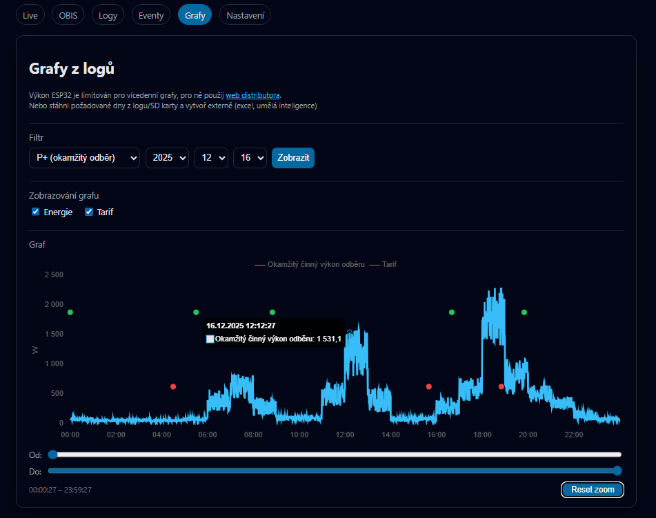

### Logy
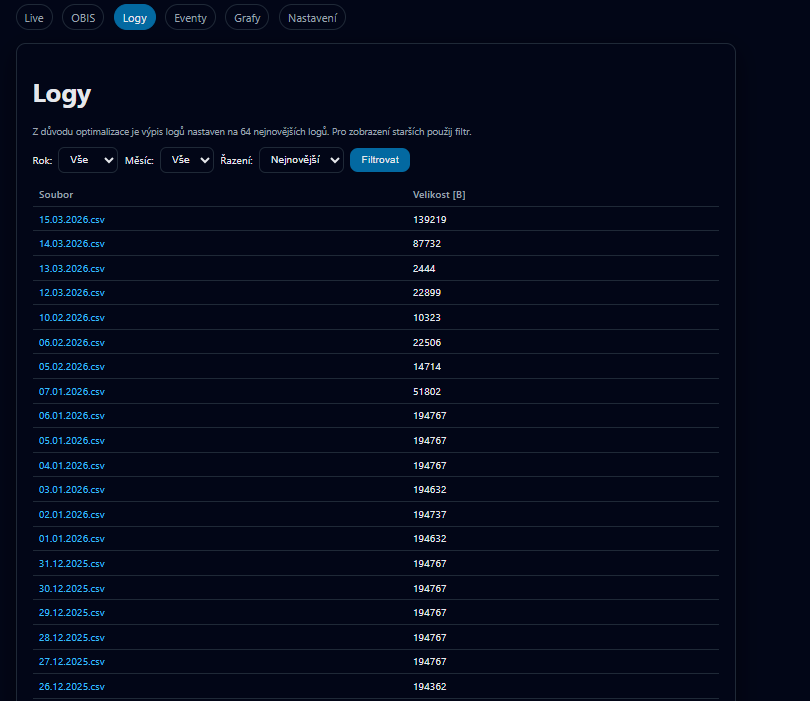

### Eventy
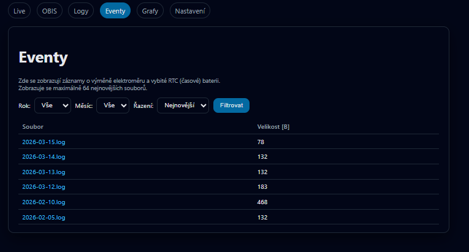

### Nastavení
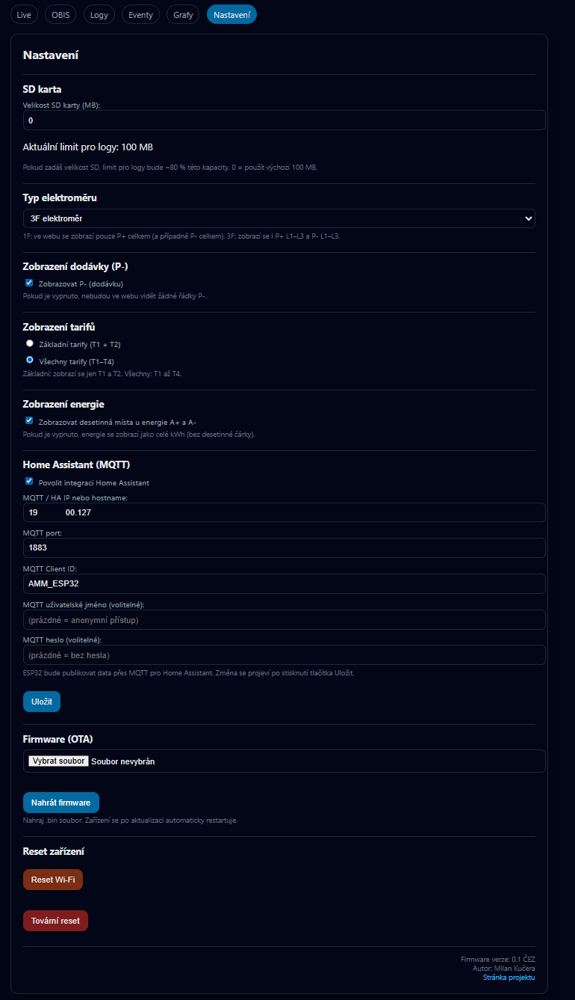

### Event – výměna elektroměru
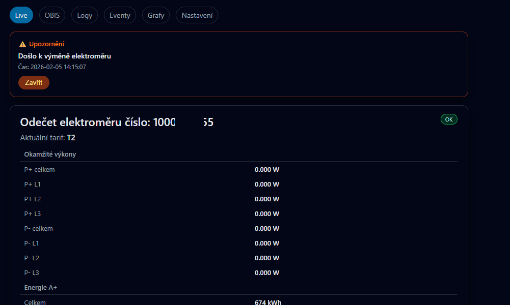

### Event – vybitá RTC baterie
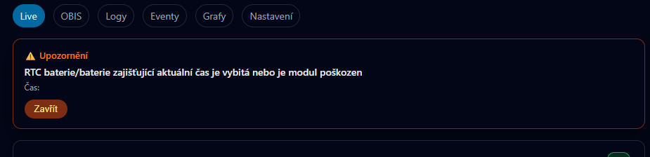

### Home Assistant – přehled zařízení
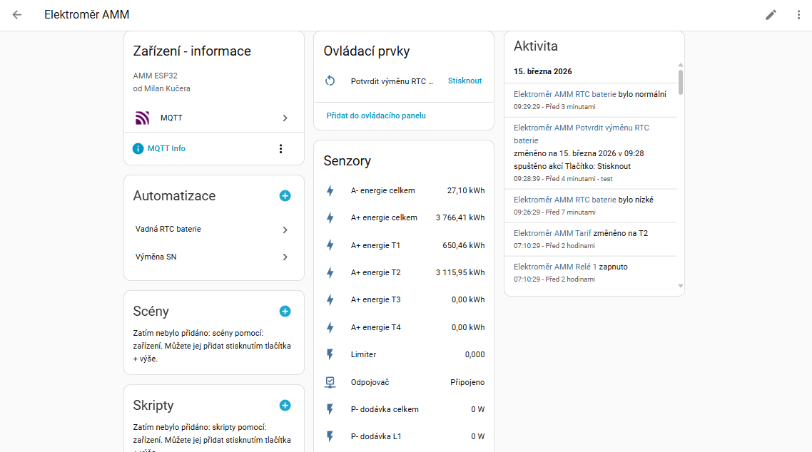

### Home Assistant – stav relé
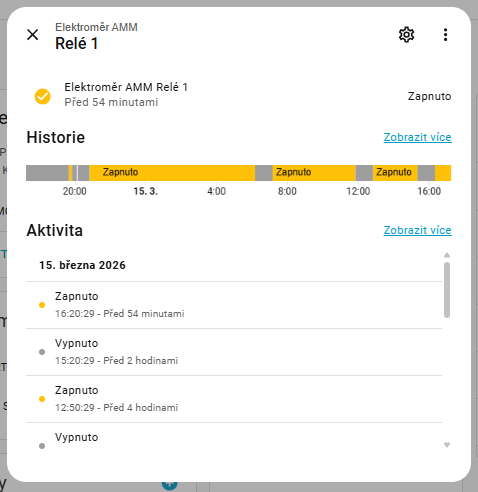

### Home Assistant – RTC baterie
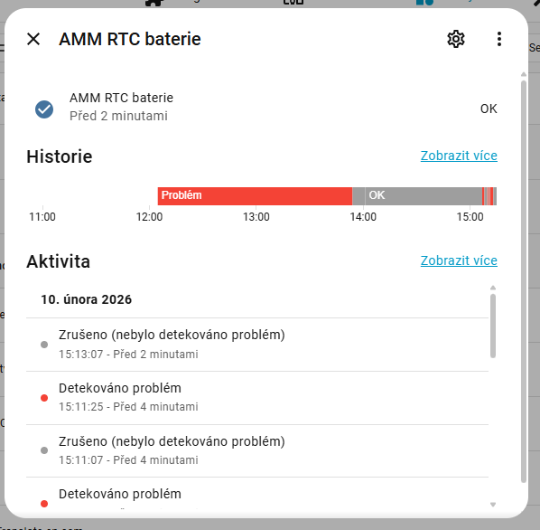

---

## 📖 Jak tento projekt vznikl

Začalo to jako jednoduchý nápad – přečíst data z elektroměru. Co mohlo být špatně?

Ukázalo se, že leccos. Projekt jsem několikrát smazal a začal úplně od nuly, pokaždé s o něco jasnějšími požadavky. Po cestě jsem narazil na pády ESP při každém příchozím OBIS kódu, zákeřnou chybu v parseru, záporné hodnoty registrů a celou řadu dalších překvapení. Člověk si řekne, že zadá prompt do AI a za odpoledne má hotovo – nakonec z toho byl projekt na celou zimu. S přestávkami, ale přesto. 😀

Výsledkem je, troufám si říct, plnohodnotný produkt, který vznikl čistě z osobní potřeby a zvědavosti. Snad bude užitečný i někomu dalšímu.

---

## 📝 Licence

Tento projekt je licencován pod **Custom Non-Commercial License** (vychází z MIT).

- ✅ Volné použití pro osobní a nekomerční účely
- ✅ Úpravy a sdílení povoleny – s uvedením odkazu na původní dílo
- ❌ Komerční využití zakázáno

Viz soubor [LICENSE](LICENSE) pro úplné znění.

---

## 🌍 Summary (English)

This project is an ESP32-based firmware for reading data from AMM smart meters used in Czech Republic via the HAN (RJ12) interface. It features a web-based dashboard, SD card logging, interactive charts, Home Assistant integration via MQTT Discovery, and OTA firmware updates. Works with both single-phase and three-phase meters. Built with ❤️ in the Czech Republic.

---

## 🤝 Přispění

Pull requesty (návrhy na úpravu) jsou vítány! Pokud narazíš na chybu nebo máš nápad na vylepšení, otevři Issue (hlášení problému nebo návrh).
